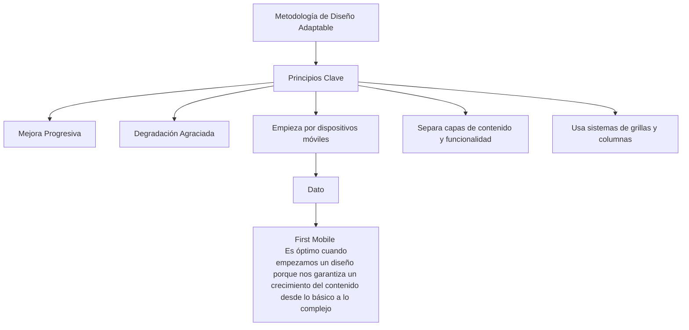
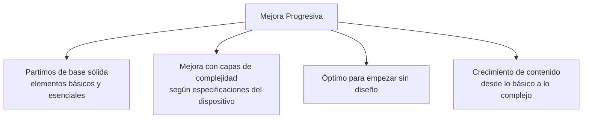
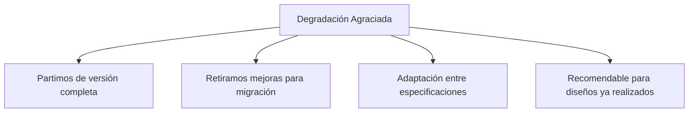
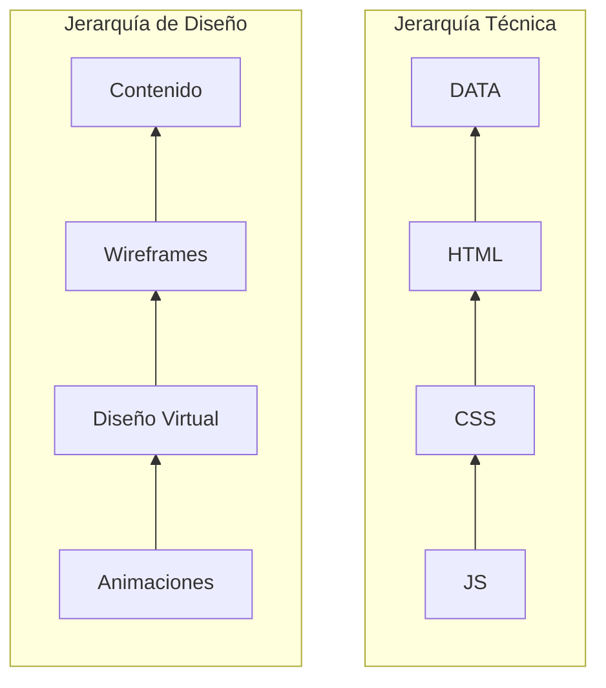

# **DISEÑO PARA DEVELOPERS**
## Clase 1
### Conceptos Básicos
1) Balance: La posición de cada elemento dad por su peso visual. El peso puede ser simétrico o asimétro.
2) Contraste: Esto puede señalar un concepto marcado por la diferencia de dos elementos distintos. Por ej.: Algo claro y algo oscuro.
3) Alineación: Crear rutas visuales, seguir una orientación que alinee nuestro diseño.
4) Proximidad: Saber agrupar nuestros elementos.
5) Repetición: Aquí podríamos hablar del concepto de marca.
6) Espacio: saber cómo usar el espacio que tenemos. Que se vea todo ordenado, que no refleje desorden ni genere incomodidad.

### Diseño Responsivo
Es una metodología que nos permite crear diferentes diseños que sean adaptables a diferentes dispositivos, ej.: celular, Tablet u ordenador. 

#### ¿Cómo garantizamos que el diseño sea responsivo?
1. Para que sea adaptable debemos empezar por dispositivos móviles. Esto nos garantiza que partimos del contenido básico hasta el contenido más complejo. Cuando comenzamos a diseñar nuestro sitio web debemos hacerlo pensando cómo se vería en nuestro celular. Comenzando desde este punto vamos a encontrar mas complejidades que comenzando desde la pantalla de un ordenador.
2. Separamos la capa de contenido con de la de funcionalidad. Así aseguramos que el contenido esté accesible a todos los usuarios.
3. Usar sistema de grillas y columnas. Las columnas son referencias para dividir el ancho de la página. Así es más fácil el diseño. La grilla es como una rejilla en nuestro diseño, que no está visible sino va a generar las columnas y estas nos van a permitir medir el espacio desde un dispositivo celular, Tablet u ordenador.

#### Métodologías para el Diseño Responsivo

### Jerarquías

### Accesibilidad y Diseño
> La accesibilidad en el diseño te asegura el acceso a todas las personas sin importar alguna discapacidad esencial.

#### Tips:
1. HTML debe estar estructurado correctamente. Para que los lectores de pantalla puedan proporcionar un detalle acertado al usuario. La semántica es importante y ayuda al SEO:
   - **Utiliza los encabezados de manera ordenada para organizar la estructura**. Cuando maquetamos la jerarquía debe estar marcada para que cuando alguien navegue con el teclado entienda la importacia dentro de esta.
2. Al usar fuentes de menor tamaño evita que las personas con problemas de vista accedan a toda la información de nuestra página:
   - **Utiliza tamaños de fuente accesible**. Se debe utilizar tamaños de fuentes que puedan ser vistas por cualquier persona sin importar el dispositivo. Evitar tamaños pequeños.
3. Si se usan colores incorrectos puede llevar a información, textos o imágenes a que no sean visibles:
   - **Utiliza colores que tengan un contraste adecuado**. No todas las personas perciben el color de la misma forma, por ello los colores deben de diferenciarse del fondo usando un buen contraste.
4. Debemos evitar la categorización únicamente por colores. Cuando se agregan categorías por colores, se ve bonito y fácil. Pero si no se le agrega alguna alternativa extra como bordes o separaciones marcadas, puede dificultar la comprensión para algunas personas:
   - **Garantiza que el color no sea la única forma de relacionar con el contenido**. Debemos de tener una alternativa del aspecto del contenido cómo bordes para ser accesible a todos los usuarios.
5. No debemos dejar a un lado los estados Focus y Active en el HTML porque estos proporcionan una ayuda visual para que el usuario sepa en que parte de la página se encuentra:
   - **Diseña teniendo en cuenta los estados "Focus" y "Active" de los componentes**. Es importante porque es una guía visual de sus acciones.
6. Debemos agregar etiquetas y textos descriptivos a campos de formularios, videos, e imágenes:
   - **Añade etiquetas y textos descriptivos a campos de formulario**. La implementación de esto, ayuda que los usuarios tenga alguna descripción de algún error y pueda ser escuchado por el lector de pantalla.
7. Debemos evitar animaciones que bloqueen el contenido. Esto provoca que aquellos que no tienen acceso por ejemplo a un mouse, no obtenga la misma cantidad de información que aquellos que sí:
   - **Escribe contenido descriptivo que pueda reemplazar vídeos e imágenes**.
   - **Garantiza que las animaciones no bloqueen el acceso al contenido**. Priorizar que la funcionalidad de la página no se vea afectado por algún implemento de diseño.

### BRIEF y Requerimientos Técnicos
- El primer elemento que debemos tener en claro para construir una aplicación.
- El brief es la hoja de ruta para empezar a diseñar. Hay que investigar y recopilar la información relativa con el proyecto a solucionar. Es a donde apuntamos esos datos que hemos recopilado.
- Secciones:
  - Descripción de la empresa o cliente.
  - Objetivos o retos.
  - Target o audencia.
  - Competencia.
  - Distribución.
- Es importante que este documento, el brief, sea bonito, esté bien organizado. Que se pueda ver bien la jerarquía de contenido. Que la persona que lea nuestro brief, entienda lo que está leyendo.
- Los objetivos es la parte más importante porque de ahí vamos a partir para crear nuestro producto. Tener un cronograma con fecha de entregas.

#### Ejemplo de Brief
1. Logo
> Información de la empresa, descripción del cliente.

2. Objetivos

4. Target o audiencia al que está destinado el producto.

5. Competencia (con sus enlaces).

6. Forma de distribución.

7. Cronograma.

#### ¿Cómo hacer un Brief?
Para elaborar un buen brief debemos responder las siguientes preguntas:
1)	¿Cuál es la necesidad, desafío o problema que se va a solucionar?
2)	¿Qué se espera lograr?
3)	¿A quién se va a impactar?
4)	¿Cuáles son los beneficios que se va a obtener?
5)	¿Cómo se va a comunicar?

#### Tipos de Brief
- **Creativo**: Plasma un proyecto novedoso. Busca un insight e información clave desde la cual puede crear piezas publicitarias, generalmente un aviso en la tv, u otros medios como va vía pública, radio o redes sociales.
- **Publicitario**: Es parecido al anterior pero orientado al marketing. Resume una iniciativa de marketing concreta que quiere ponerse en marcha. Puede ser el lanzamiento de un nuevo producto, el nuevo sabor de una bebida, una festividad especial por ej.: el día de las madres o Black Friday o simplemente el posicionamiento de una marca.
- **Comunicación**: Contiene piezas claves para la estrategia de comunicación o relaciones públicas. Esto quiere decir que puede incluir activaciones, eventos con periodistas, trabajos con influencers.
- **Diseño**: Responde a un requerimiento que se busca resolver desde el área visual. Puede ser para un sitio, un newsletter, piezas para redes sociales, presentaciones, brochure institucionales, documentos descargables, blogs, landing pages etc. Generalmente contiene información técnica sobre los formatos y sus especificaciones.
- **Programación**: Contiene todo lo que necesita una empresa. Marca, profesional o emprendedor, y que se puede responder con un sitio, blog, herramienta o app. Tambien incluye los elementos que el cliente esperan del sitio, sus funcionalidades obligatorias y otros detalles.
La respuesta de este tipo de brief se divide en dos. La primera va a ser el backend esto se orienta a como luce el sitio desde el punto de vista del programador. Y la otra es el frontend que se orienta a como luce para el usuario desde el diseño.
- **Negocio**: Es un documento que resume las necesidades y expectativas de un proyecto de negocio. Generalmente incluye información sobre el objetivo del proyecto, el público objetivo, el mensaje clave y el posicionamiento de la marca. Tambien puede incluir un análisis de la competencia, una estrategia de marketing, un plan de acción detallado. Esta es una herramienta importante para ayudar a las empresas a definir y enfocar sus esfuerzos de negocio y comunicar de manera clara y concisa sus objetivos y expectativas a todos los involucrados en el proyecto.

En el momento de recibir un brief de parte del cliente, debemos analizarlo si la solicitud del cliente es realmente lo que el/ella necesita. Con profundidad analizamos el pedido y pedimos clarificación si hiciera falta. Debemos asesorarlo y gestionar y presentar algo diferente a lo solicitado y justificar para brindarle más peso a la decisión que nosotros queremos introducir al cliente.

Deberemos reescribir ese brief para que quede aún más claro para el cliente y para nosotros.

Tambien necesitamos aprovechar el uso de la herramienta del brief por ejemplo en marketing, por más sencillo que sea el pedido, veremos que podremos experimentar una mayor eficacia en el empleo del tiempo y nivel de efectividad a la hora de transmitir lo que necesitamos.

---

